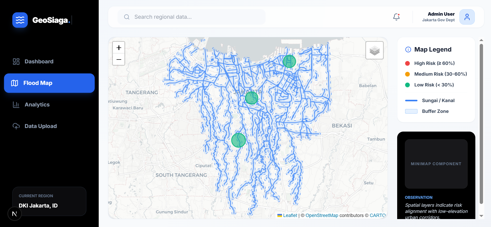

Siap—aku sudah sesuaikan README kamu dengan **penambahan gambar dari folder `assets/GeoSiagaMap.PNG`** dan ditaruh di bagian yang paling impactful (hero preview + section map). Tinggal copy-paste 👇

---

# 🌊 GeoSpatial Predictive Flood Jakarta (2016–2020)

<p align="center">
  
</p>

<p align="center">
  <i>Interactive GIS-based flood prediction map for Jakarta (2016–2020)</i>
</p>

---

Sistem prediksi banjir berbasis **Geospatial AI** yang menganalisis pola historis banjir di Jakarta menggunakan kombinasi **Machine Learning** dan **GIS (Geographic Information System)**.

Proyek ini mengintegrasikan data spasial, kondisi cuaca, serta analisis model untuk menghasilkan **prediksi risiko banjir secara interaktif dan real-time**.

---

## 🚀 Overview

Jakarta merupakan salah satu kota dengan risiko banjir tinggi akibat kombinasi faktor:

* Curah hujan tidak menentu 🌧️
* Kedekatan dengan sungai & DAS 🏞️
* Urbanisasi & perubahan tata ruang 🏙️

Melalui pendekatan **GeoSpatial + Machine Learning**, proyek ini bertujuan untuk:

* Memprediksi probabilitas banjir
* Memvisualisasikan area rawan
* Memberikan insight berbasis data historis (2016–2020)

---

## 🧠 Key Features

* Visualisasi GIS berbasis peta interaktif
* Layer sungai, buffer zone, dan prediksi model
* Integrasi Leaflet untuk eksplorasi real-time

---

### 📊 Advanced Analytics

* Perbandingan performa model (ROC-AUC)
* Feature importance (faktor paling berpengaruh)
* Timeline historis kejadian banjir

---

### ⚡ Dynamic Prediction API

* Prediksi probabilitas banjir berbasis input cuaca
* Endpoint API menggunakan FastAPI

---

### 🔄 Automated Data Pipeline

* Upload dataset baru (CSV)
* Auto retrain model
* Dashboard langsung ter-update

---

## 🏗️ Tech Stack

### 🎨 Frontend

* Next.js (App Router)
* TypeScript
* Tailwind CSS
* Leaflet (GIS Visualization)
* Recharts (Analytics)

### ⚙️ Backend

* FastAPI
* GeoPandas
* OSMnx
* Scikit-Learn
* XGBoost

### 🤖 Machine Learning Models

* Random Forest
* XGBoost
* Ensemble Learning (Hybrid Model)

---

## ⚙️ Installation & Setup

### 1️⃣ Clone Repository

```bash
git clone https://github.com/Lutfiandraa/GeoSiaga.git
cd GeoSiaga
```

---

### 2️⃣ Backend Setup

```bash
cd backend
pip install -r requirements.txt
```

---

### 3️⃣ Generate Models & Outputs

Jalankan script ini sekali untuk:

* preprocessing data GIS
* training model
* generate output

```bash
python mount_outputs.py
```

---

### 4️⃣ Run Backend Server

```bash
python -m uvicorn backend.main:app --port 8000 --reload
```

Server akan berjalan di:

```
http://127.0.0.1:8000
```

---

## 📡 API Endpoint (Example)

| Endpoint    | Method | Description                  |
| ----------- | ------ | ---------------------------- |
| `/predict`  | POST   | Prediksi probabilitas banjir |
| `/features` | GET    | Feature importance           |
| `/history`  | GET    | Data historis banjir         |

---

## 📊 Dataset Scope

* 📍 Lokasi: Jakarta
* 📅 Tahun: 2016 – 2020
* 🧾 Data:

  * Curah hujan
  * Kedekatan sungai
  * Elevasi wilayah
  * Data kejadian banjir historis

---

## 🎯 Project Goals

* Meningkatkan mitigasi risiko banjir berbasis data
* Memberikan insight bagi perencana kota
* Menggabungkan GIS + AI dalam satu platform

---

## 🧩 Future Improvements

* Integrasi real-time weather API 🌦️
* Deep Learning (LSTM untuk time-series)
* Deployment ke cloud (Docker + Kubernetes)
* Mobile-friendly dashboard 📱

---

## 👨‍💻 Author

Developed by **Lutfiandra**
Fullstack Developer | Data & AI Engineer

---

## ⭐ Closing

> “Turning spatial data into actionable flood intelligence.”

---
